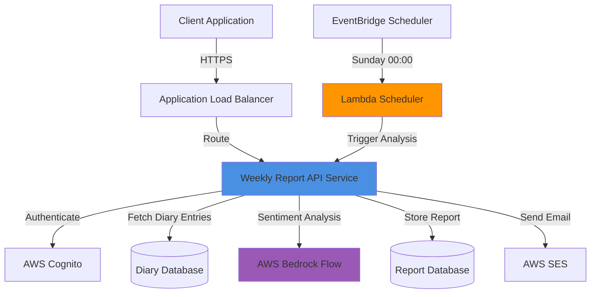

# Design Document: Weekly Report System

## Overview

The Weekly Report System is a microservice that analyzes users' diary entries over a week-long period to provide emotional insights and behavioral patterns. The system integrates with AWS Bedrock for AI-powered sentiment analysis, AWS Lambda for scheduled execution, and AWS SES for email notifications. It operates within a Microservices Architecture (MSA) and is accessible through an Application Load Balancer (ALB).

### Key Features
- Automated weekly diary analysis triggered every Sunday at midnight
- AI-powered sentiment scoring (1-10 scale) using AWS Bedrock
- Pattern recognition for activities, experiences, and weather correlations
- Personalized feedback based on emotional trends
- Email notifications upon analysis completion
- RESTful API for manual report generation and retrieval

## Architecture

### System Components



### Deployment Architecture

The service is deployed as a containerized microservice in a Kubernetes cluster:

- **Ingress**: Routes traffic from ALB to the service based on path rules
- **Service**: Exposes the API pods internally within the cluster
- **Deployment**: Manages pod replicas for high availability
- **ConfigMap/Secrets**: Stores configuration and sensitive credentials

### Data Flow

1. **Manual Report Generation**:
   - User requests report via API → Authenticate with Cognito → Fetch diary entries → Analyze with Bedrock → Generate report → Store in database → Return to user

2. **Automated Weekly Analysis**:
   - EventBridge triggers Lambda at Sunday 00:00 → Lambda invokes API for each user → API processes as above → Send email via SES

## Components and Interfaces

### 1. API Service

**Technology**: Node.js with Express (or Python with FastAPI)

**Endpoints**:

```typescript
// POST /report/create
interface CreateReportRequest {
  startDate?: string;  // ISO 8601 format, optional
  endDate?: string;    // ISO 8601 format, optional
}

interface CreateReportResponse {
  reportId: string;
  userId: string;
  nickname: string;
  weekPeriod: {
    start: string;
    end: string;
  };
  averageScore: number;
  evaluation: string;
  dailyAnalysis: DailyAnalysis[];
  patterns: Pattern[];
  feedback: string[];
}

// GET /report/create/{nickname}
interface GetReportResponse {
  reportId: string;
  nickname: string;
  createdAt: string;
  summary: {
    diaryContent: string[];
    currentDate: string;
    authorNickname: string;
  };
}
```

**Core Functions**:

```typescript
class WeeklyReportService {
  // Authenticate user and extract Cognito sub
  async authenticateUser(token: string): Promise<UserInfo>;
  
  // Retrieve diary entries for analysis period
  async fetchDiaryEntries(userId: string, startDate: Date, endDate: Date): Promise<DiaryEntry[]>;
  
  // Send diary data to Bedrock for analysis
  async analyzeSentiment(diaryEntries: DiaryEntry[]): Promise<SentimentAnalysis>;
  
  // Generate evaluation and feedback
  async generateReport(analysis: SentimentAnalysis): Promise<WeeklyReport>;
  
  // Store report in database
  async saveReport(report: WeeklyReport): Promise<string>;
  
  // Send email notification
  async sendEmailNotification(userId: string, report: WeeklyReport): Promise<void>;
}
```

### 2. Lambda Scheduler

**Technology**: AWS Lambda (Node.js or Python)

**Trigger**: EventBridge rule (cron: `0 0 ? * SUN *`)

**Function**:

```typescript
async function weeklyReportScheduler(event: EventBridgeEvent): Promise<void> {
  // 1. Query database for users with diary entries in past week
  const eligibleUsers = await getEligibleUsers();
  
  // 2. For each user, invoke API to generate report
  for (const user of eligibleUsers) {
    await invokeReportGeneration(user.id);
  }
  
  // 3. Log execution summary
  logSchedulerExecution(eligibleUsers.length);
}
```

### 3. Bedrock Integration

**Flow Configuration**:
- Flow ID: `BZKT7TJGPT`
- Alias ID: `QENFHYZ1KE`

**Input Format**:

```typescript
interface BedrockInput {
  documents: {
    diaryContent: string;
    createdDate: string;
    authorNickname: string;
  }[];
}
```

**Output Format**:

```typescript
interface BedrockOutput {
  dailyScores: {
    date: string;
    score: number;  // 1-10
    sentiment: string;
    keyThemes: string[];
  }[];
  weeklyInsights: {
    positivePatterns: string[];
    negativePatterns: string[];
    recommendations: string[];
  };
}
```

### 4. Email Service

**Technology**: AWS SES

**Email Template**:

```html
<!DOCTYPE html>
<html>
<head>
  <title>주간 감정 분석 완료</title>
</head>
<body>
  <h1>{{nickname}}님의 주간 감정 분석이 완료되었습니다</h1>
  <p>분석 기간: {{startDate}} ~ {{endDate}}</p>
  <p>평균 감정 점수: {{averageScore}}/10</p>
  <p>{{evaluation}}</p>
  <a href="{{reportLink}}">전체 리포트 보기</a>
</body>
</html>
```

## Data Models

### 기존 테이블 (사용)

#### history (일기 테이블) - 기존 테이블 활용

```python
# 기존 DB 테이블 구조 (읽기 전용으로 사용)
class History(Base):
    __tablename__ = "history"
    
    id: int                    # bigint, PK
    user_id: str               # varchar, Cognito sub
    content: str               # text, 일기 내용
    record_date: date          # date, 작성 날짜
    tags: List[str]            # array, 태그 목록 (활동, 날씨 등)
    s3_key: Optional[str]      # text, S3 파일 키
    text_url: Optional[str]    # text, 텍스트 URL
```

#### users (사용자 테이블) - 기존 테이블 활용

```python
# 기존 DB 테이블 구조 (읽기 전용으로 사용)
class User(Base):
    __tablename__ = "users"
    
    user_id: str               # varchar, PK, Cognito sub
    email: str                 # varchar, 이메일
    nickname: str              # varchar, 닉네임 (preferred_username)
    status: Optional[str]      # varchar, 상태
    created_at: datetime       # timestamp
    updated_at: datetime       # timestamp
    deleted_at: Optional[datetime]  # timestamp, soft delete
```

### 신규 테이블 (생성 필요)

#### weekly_reports (주간 리포트 테이블) - 신규 생성

```python
class WeeklyReport(Base):
    __tablename__ = "weekly_reports"
    
    id: int                    # serial, PK
    user_id: str               # varchar, FK -> users.user_id
    nickname: str              # varchar, 작성 시점의 닉네임
    week_start: date           # date, 분석 시작일 (월요일)
    week_end: date             # date, 분석 종료일 (일요일)
    average_score: float       # decimal(3,1), 주간 평균 점수
    evaluation: str            # varchar, 'positive' | 'negative'
    daily_analysis: dict       # jsonb, 일별 분석 결과
    patterns: dict             # jsonb, 패턴 분석 결과
    feedback: List[str]        # jsonb, 피드백 목록
    created_at: datetime       # timestamp, 생성 시간
```

### 데이터 타입 정의

```python
from dataclasses import dataclass
from typing import List, Optional
from datetime import date, datetime

@dataclass
class DailyAnalysis:
    """일별 분석 결과"""
    date: date
    score: float               # 1-10 점수
    sentiment: str             # 감정 상태
    diary_content: str         # 일기 내용 요약
    key_themes: List[str]      # 주요 테마

@dataclass
class Pattern:
    """패턴 분석 결과"""
    type: str                  # 'activity' | 'experience' | 'weather'
    value: str                 # 패턴 값 (예: '운동', '비', '친구 만남')
    correlation: str           # 'positive' | 'negative'
    frequency: int             # 발생 빈도
    average_score: float       # 해당 패턴의 평균 점수

@dataclass
class UserInfo:
    """사용자 정보 (Cognito + DB 조합)"""
    user_id: str               # Cognito sub
    email: str                 # 이메일
    nickname: str              # 닉네임
```

## Correctness Properties


*A property is a characteristic or behavior that should hold true across all valid executions of a system—essentially, a formal statement about what the system should do. Properties serve as the bridge between human-readable specifications and machine-verifiable correctness guarantees.*

### Property 1: Complete Diary Entry Retrieval

*For any* user and any time period, when retrieving diary entries, the system should return exactly all diary entries created by that user within the specified period, with no duplicates or omissions.

**Validates: Requirements 1.1**

### Property 2: User Identification via Cognito

*For any* user request, the system should identify and retrieve user information (sub and preferred_username) exclusively from Cognito user attributes, never from request parameters or other sources.

**Validates: Requirements 1.2, 1.5**

### Property 3: Insufficient Data Error Handling

*For any* user with zero diary entries in the analysis period, the system should return an error response indicating insufficient data rather than attempting to generate a report.

**Validates: Requirements 1.4**

### Property 4: Complete Bedrock Submission

*For any* set of collected diary entries, all entries should be included in the Bedrock Flow request with no entries omitted or duplicated.

**Validates: Requirements 2.1**

### Property 5: Bedrock Document Formatting

*For any* diary entry sent to Bedrock, the formatted document should contain all three required fields: diary content, creation date, and author nickname.

**Validates: Requirements 2.3**

### Property 6: Daily Score Completeness

*For any* week with diary entries, the Bedrock analysis should return a sentiment score for each day that has at least one diary entry.

**Validates: Requirements 2.4**

### Property 7: Score-to-Entry Association

*For any* sentiment score returned by Bedrock, the score should be correctly associated with the diary entry's date and content, maintaining referential integrity.

**Validates: Requirements 2.5**

### Property 8: Average Score Calculation

*For any* set of daily sentiment scores, the computed weekly average should equal the arithmetic mean of all daily scores.

**Validates: Requirements 3.1**

### Property 9: Evaluation Type Determination

*For any* weekly average score, the evaluation type should be "negative" if the score is below 5, and "positive" if the score is 5 or above.

**Validates: Requirements 3.2, 3.3**

### Property 10: Pattern Correlation Detection

*For any* week of diary entries with metadata (activities, experiences, weather), the system should identify correlations between these factors and sentiment scores, grouping similar factors that appear with similar score ranges.

**Validates: Requirements 3.4**

### Property 11: Evaluation Evidence Inclusion

*For any* generated evaluation, the feedback text should contain at least one direct reference or excerpt from the actual diary entries to support the conclusions.

**Validates: Requirements 3.5**

### Property 12: Extreme Day Identification

*For any* week with multiple diary entries, when the average score is below 5, the system should correctly identify the day(s) with the lowest scores; when the average is 5 or above, it should identify the day(s) with the highest scores.

**Validates: Requirements 4.1, 5.1**

### Property 13: Theme Extraction from Entries

*For any* set of diary entries (high-scoring or low-scoring), the system should extract common themes (activities, experiences, weather) that appear in multiple entries within that set.

**Validates: Requirements 4.2, 5.2**

### Property 14: Feedback Contextualization

*For any* generated feedback, each feedback item should reference at least one specific date and diary entry to provide context for the recommendation.

**Validates: Requirements 4.4, 5.4**

### Property 15: Pattern Prioritization

*For any* set of identified patterns (positive or negative), the patterns should be ordered by impact (combination of frequency and score correlation), with the most impactful patterns appearing first in the feedback.

**Validates: Requirements 4.5, 5.5**

### Property 16: Authentication Requirement

*For any* API request to create or retrieve reports, the system should perform Cognito authentication before processing the request.

**Validates: Requirements 6.2**

### Property 17: Successful Response Format

*For any* successful report generation, the API should return HTTP 200 status with a response body containing all required fields: reportId, userId, nickname, weekPeriod, averageScore, evaluation, dailyAnalysis, patterns, and feedback.

**Validates: Requirements 6.4**

### Property 18: Error Response Codes

*For any* failed request, the system should return an appropriate HTTP error code (400 for bad requests, 401 for authentication failures, 404 for not found, 500 for server errors, 503 for service unavailable) with a descriptive error message.

**Validates: Requirements 6.5, 9.4, 12.1, 12.2**

### Property 19: Nickname-Based User Lookup

*For any* GET request with a nickname parameter, the system should query Cognito to find the user with matching preferred_username before retrieving their report.

**Validates: Requirements 7.2**

### Property 20: Most Recent Report Retrieval

*For any* user with multiple reports, the GET endpoint should return the report with the most recent createdAt timestamp.

**Validates: Requirements 7.3**

### Property 21: Report Summary Completeness

*For any* report summary response, the response should include all required fields: diary content array, current date, and author nickname.

**Validates: Requirements 7.4**

### Property 22: Not Found Handling

*For any* user without existing reports, the GET endpoint should return HTTP 404 with a message indicating no reports were found.

**Validates: Requirements 7.5**

### Property 23: User Data Isolation

*For any* authenticated user, the system should only return diary entries and reports belonging to that user, never exposing data from other users.

**Validates: Requirements 9.1**

### Property 24: Log Data Sanitization

*For any* processing operation, system logs should not contain raw diary content, only metadata such as entry IDs, dates, and processing status.

**Validates: Requirements 9.3**

### Property 25: Authorization Before Access

*For any* operation that retrieves Cognito user attributes, the system should verify the user's authorization token is valid before making the Cognito API call.

**Validates: Requirements 9.5**

### Property 26: Eligible User Identification

*For any* scheduled execution, the system should identify all users who have at least one diary entry in the previous week (Monday-Sunday) as eligible for report generation.

**Validates: Requirements 10.2**

### Property 27: Batch Report Generation

*For any* set of eligible users identified by the scheduler, the system should attempt to generate a report for each user, regardless of individual failures.

**Validates: Requirements 10.3**

### Property 28: Error Isolation in Batch Processing

*For any* batch report generation, if report generation fails for one user, the system should log the error and continue processing remaining users without interruption.

**Validates: Requirements 10.5**

### Property 29: Email Notification Trigger

*For any* successfully generated report, the system should trigger an email notification to the user's Cognito email address.

**Validates: Requirements 11.1**

### Property 30: Email Address Retrieval

*For any* email notification, the recipient email address should be retrieved from the user's Cognito email attribute, not from request parameters or other sources.

**Validates: Requirements 11.2**

### Property 31: Email Content Completeness

*For any* email notification, the email body should include a summary of the weekly analysis (average score, evaluation type) and a link to view the full report.

**Validates: Requirements 11.4**

### Property 32: Email Failure Resilience

*For any* report generation where email sending fails, the report should still be saved successfully and the API should return success, with the email error logged separately.

**Validates: Requirements 11.5**

### Property 33: Bedrock Timeout Handling

*For any* Bedrock Flow request that exceeds 30 seconds, the system should terminate the request and return an appropriate timeout error.

**Validates: Requirements 12.4**

### Property 34: Partial Data Warning

*For any* analysis period where some days have diary entries and other days do not, the generated report should include a warning indicating incomplete data coverage.

**Validates: Requirements 12.5**

## Error Handling

### Error Categories

1. **Authentication Errors (401)**
   - Invalid or expired Cognito token
   - Missing authentication header
   - User not found in Cognito

2. **Authorization Errors (403)**
   - User attempting to access another user's data
   - Insufficient permissions for operation

3. **Client Errors (400)**
   - Invalid date format in request
   - Missing required parameters
   - Invalid nickname format

4. **Not Found Errors (404)**
   - No reports exist for user
   - User not found by nickname

5. **Server Errors (500)**
   - Database connection failures
   - Unexpected exceptions in processing
   - Data corruption or integrity issues

6. **Service Unavailable (503)**
   - Bedrock Flow unavailable
   - SES service unavailable
   - Cognito service unavailable

### Error Response Format

```typescript
interface ErrorResponse {
  error: {
    code: string;
    message: string;
    details?: any;
    timestamp: string;
  };
}
```

### Retry Strategy

- **Bedrock Flow**: Exponential backoff with 3 retries (1s, 2s, 4s)
- **SES**: Exponential backoff with 2 retries (1s, 2s)
- **Cognito**: No retry (fail fast for authentication)
- **Database**: Exponential backoff with 3 retries (500ms, 1s, 2s)

## Testing Strategy

### Dual Testing Approach

The Weekly Report System will employ both unit testing and property-based testing to ensure comprehensive coverage:

**Unit Tests**: Verify specific examples, edge cases, and error conditions
- Test specific date range calculations (e.g., "most recent complete week")
- Test specific Bedrock Flow configuration (Flow ID and Alias ID)
- Test specific API endpoint existence and routing
- Test email template rendering with sample data
- Test error responses for specific failure scenarios

**Property Tests**: Verify universal properties across all inputs
- Test that diary retrieval works correctly for any user and any date range
- Test that sentiment analysis handles any valid diary content
- Test that pattern detection works for any combination of activities/weather
- Test that authentication works for any valid/invalid token
- Test that batch processing handles any number of users

**Property-Based Testing Configuration**:
- Library: `fast-check` (for TypeScript/JavaScript) or `hypothesis` (for Python)
- Minimum iterations: 100 per property test
- Each property test must reference its design document property
- Tag format: `Feature: weekly-report, Property {number}: {property_text}`

### Test Coverage Goals

- **Unit Test Coverage**: Minimum 80% code coverage
- **Property Test Coverage**: All 34 correctness properties implemented
- **Integration Tests**: End-to-end flows for manual and automated report generation
- **Load Tests**: Batch processing of 1000+ users in scheduled execution

### Example Property Test

```typescript
// Feature: weekly-report, Property 1: Complete Diary Entry Retrieval
describe('Property 1: Complete Diary Entry Retrieval', () => {
  it('should retrieve exactly all diary entries for any user and period', () => {
    fc.assert(
      fc.asyncProperty(
        fc.string(), // userId
        fc.date(), // startDate
        fc.date(), // endDate
        fc.array(fc.record({
          id: fc.string(),
          userId: fc.string(),
          content: fc.string(),
          createdAt: fc.date()
        })),
        async (userId, startDate, endDate, allEntries) => {
          // Setup: Insert entries into test database
          await setupTestData(allEntries);
          
          // Execute: Retrieve entries for user and period
          const retrieved = await fetchDiaryEntries(userId, startDate, endDate);
          
          // Verify: Retrieved entries match expected entries
          const expected = allEntries.filter(e => 
            e.userId === userId &&
            e.createdAt >= startDate &&
            e.createdAt <= endDate
          );
          
          expect(retrieved).toHaveLength(expected.length);
          expect(retrieved).toEqual(expect.arrayContaining(expected));
        }
      ),
      { numRuns: 100 }
    );
  });
});
```

### Integration Test Scenarios

1. **Manual Report Generation Flow**
   - User authenticates → Requests report → System fetches diaries → Bedrock analyzes → Report generated → User receives response

2. **Automated Weekly Flow**
   - EventBridge triggers Lambda → Lambda identifies eligible users → Reports generated for all → Emails sent → Success logged

3. **Error Recovery Flow**
   - Bedrock unavailable → System retries → Eventually returns 503 → User can retry later

4. **Partial Data Flow**
   - User has only 3 days of diaries → System generates report → Warning included about incomplete data

## Implementation Notes

### Technology Stack Recommendations

**Option 1: Node.js/TypeScript**
- Framework: Express.js or Fastify
- Testing: Jest + fast-check
- AWS SDK: @aws-sdk/client-bedrock-runtime, @aws-sdk/client-ses, @aws-sdk/client-cognito-identity-provider
- Database: PostgreSQL with TypeORM or Prisma

**Option 2: Python**
- Framework: FastAPI
- Testing: pytest + hypothesis
- AWS SDK: boto3
- Database: PostgreSQL with SQLAlchemy

### Kubernetes Configuration

**Deployment**:
```yaml
apiVersion: apps/v1
kind: Deployment
metadata:
  name: weekly-report-service
spec:
  replicas: 3
  selector:
    matchLabels:
      app: weekly-report
  template:
    metadata:
      labels:
        app: weekly-report
    spec:
      containers:
      - name: weekly-report
        image: weekly-report:latest
        ports:
        - containerPort: 3000
        env:
        - name: BEDROCK_FLOW_ID
          value: "BZKT7TJGPT"
        - name: BEDROCK_FLOW_ALIAS_ID
          value: "QENFHYZ1KE"
```

**Ingress**:
```yaml
apiVersion: networking.k8s.io/v1
kind: Ingress
metadata:
  name: weekly-report-ingress
  annotations:
    kubernetes.io/ingress.class: alb
spec:
  rules:
  - host: api.aws11.shop
    http:
      paths:
      - path: /report/*
        pathType: Prefix
        backend:
          service:
            name: weekly-report-service
            port:
              number: 3000
```

### CI/CD Pipeline

**GitHub Actions Workflow**:
```yaml
name: Deploy Weekly Report Service
on:
  push:
    branches: [main]
jobs:
  deploy:
    runs-on: ubuntu-latest
    steps:
      - uses: actions/checkout@v2
      - name: Build Docker image
        run: docker build -t weekly-report:${{ github.sha }} .
      - name: Push to ECR
        run: |
          aws ecr get-login-password | docker login --username AWS --password-stdin $ECR_REGISTRY
          docker push weekly-report:${{ github.sha }}
      - name: Deploy to EKS
        run: |
          kubectl set image deployment/weekly-report-service weekly-report=weekly-report:${{ github.sha }}
```

### Database Schema

**기존 테이블 (변경 없음)**:

```sql
-- 기존 history 테이블 (일기 데이터)
-- 이 테이블은 이미 존재하며 변경하지 않음
CREATE TABLE history (
  id BIGINT PRIMARY KEY,
  user_id VARCHAR(255) NOT NULL,
  content TEXT NOT NULL,
  record_date DATE NOT NULL,
  tags TEXT[],
  s3_key TEXT,
  text_url TEXT
);

-- 기존 users 테이블 (사용자 데이터)
-- 이 테이블은 이미 존재하며 변경하지 않음
CREATE TABLE users (
  user_id VARCHAR(255) PRIMARY KEY,
  email VARCHAR(255) NOT NULL,
  nickname VARCHAR(255) NOT NULL,
  status VARCHAR(50),
  created_at TIMESTAMP DEFAULT NOW(),
  updated_at TIMESTAMP DEFAULT NOW(),
  deleted_at TIMESTAMP
);
```

**신규 테이블 (생성 필요)**:

```sql
-- 주간 리포트 테이블 (신규 생성)
CREATE TABLE weekly_reports (
  id SERIAL PRIMARY KEY,
  user_id VARCHAR(255) NOT NULL REFERENCES users(user_id),
  nickname VARCHAR(255) NOT NULL,
  week_start DATE NOT NULL,
  week_end DATE NOT NULL,
  average_score DECIMAL(3,1) NOT NULL,
  evaluation VARCHAR(20) NOT NULL CHECK (evaluation IN ('positive', 'negative')),
  daily_analysis JSONB NOT NULL,
  patterns JSONB NOT NULL,
  feedback JSONB NOT NULL,
  created_at TIMESTAMP NOT NULL DEFAULT NOW()
);

-- 인덱스 생성
CREATE INDEX idx_weekly_reports_user_created ON weekly_reports(user_id, created_at DESC);
CREATE INDEX idx_weekly_reports_nickname ON weekly_reports(nickname);
CREATE INDEX idx_weekly_reports_week ON weekly_reports(week_start, week_end);

-- history 테이블에 인덱스 추가 (성능 최적화, 이미 없는 경우에만)
CREATE INDEX IF NOT EXISTS idx_history_user_date ON history(user_id, record_date);
```

**daily_analysis JSONB 구조**:
```json
[
  {
    "date": "2026-01-13",
    "score": 7.5,
    "sentiment": "긍정적",
    "diary_content": "오늘 친구와 맛있는 점심을 먹었다...",
    "key_themes": ["친구", "음식", "외출"]
  }
]
```

**patterns JSONB 구조**:
```json
[
  {
    "type": "activity",
    "value": "운동",
    "correlation": "positive",
    "frequency": 3,
    "average_score": 8.2
  }
]
```

**feedback JSONB 구조**:
```json
[
  "1월 13일에 친구와의 만남이 기분을 좋게 했습니다. 사회적 활동을 계속 유지하세요.",
  "운동을 한 날의 평균 점수가 8.2점으로 높았습니다. 규칙적인 운동을 권장합니다."
]
```
